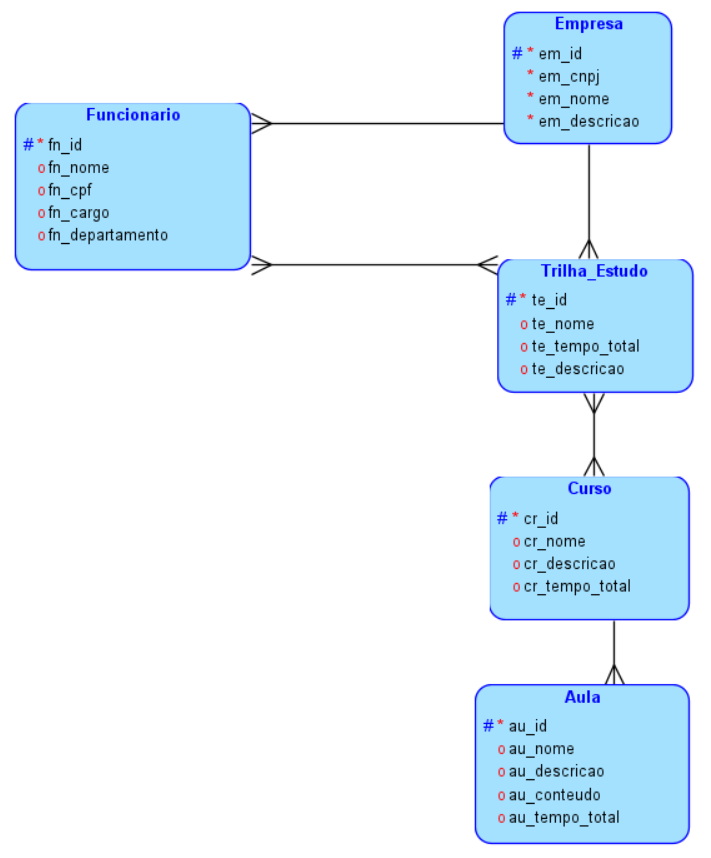
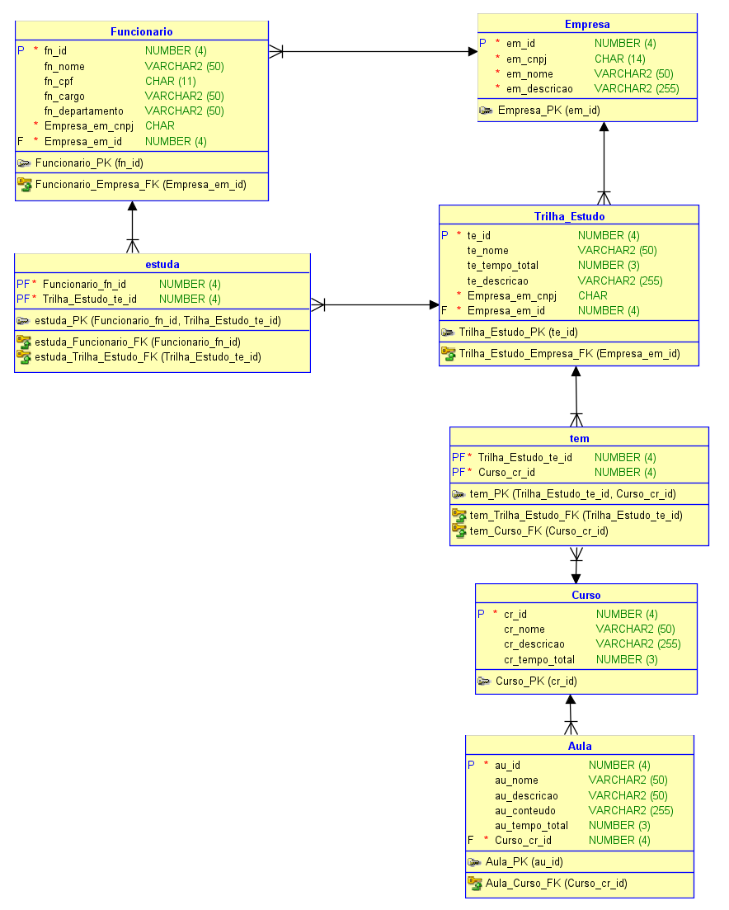

## Documentação da API - Genesis Academy

## Como Rodar a Aplicação
Para rodar a aplicação localmente, siga os passos abaixo:

1. Clone este repositório para o seu ambiente local.
2. Navegue até o diretório do projeto.
3. Rodar LeadtechApplication como java application para iniciar o servidor Spring Boot.
4. Acesse a aplicação em `http://localhost:8080`.

## Diagramas
Aqui estão os diagramas do projeto:

### Diagrama de MER/DER

## Descrição do Problema a Resolver

O processo de recrutamento de novos funcionários é algo que sempre vai existir no dia a dia de todas as empresas em todo o mundo. De tempos em tempos é necessário (e inclusive, muito recompensador) trazer novas peças às lacunas existentes nos times de uma corporação. Mas, algo que muitas vezes não é levado em consideração, ainda mais por aqueles que estão buscando uma vaga em uma dessas empresas, é que todo esse processo de contratação de novos funcionários é algo bem mais trabalhoso do que normalmente imaginamos, além de poder escalonar a algo que gera grandes custos instituicionais. 

Isso porque, todo o processo de contratar um novo integrante a um time afeta e se alastra para outras áreas da referente empresa, e não fica só parado no time de RH. Isso porque, todo novo integrante precisa passar por uma fase de adaptação, integração e treinamento assim que é contratado. E esse processo, além de ser trabalhoso e não necessariamente recompensador de imediato para os processos diários da empresa, é algo que é muitas vezes feito com uma qualidade não muito satisfatória, ocasionando em um mal desenvolvimento desse novo funcionário a seu novo cargo.

Os motivos para esse tipo de situação existir são inúmeros: às vezes o time do qual este funcionário acabara de ser incluído, precisa cumprir com metas recorrentes, e não tem tempo para pausar suas atividades rotineiras, para demandar um tempo de treinamento com esse novo colaborador. E então, esta nova peça fica de escanteio, tentando “pescar” informações e ensinamentos quanto às atividades empresariais, ao acompanhar esses outros colegas trabalhando, ao invés de aprender de uma vez por todas e definitivamente.

Cremos que utilizando de IAs generativas, e uma análise e mapeamento dos resultados mostrados por esse novo colaborador, conseguimos convergir todas as soluções que visamos ser necessárias para com que este problema venha a diminuir. Explicaremos melhor e mais especificamente, ao decorrer do documento.

## Descrição dos Objetivos da Solução Idealizada:
Visando solucionar o problema levantado no tópico anterior, a nossa equipe deseja desenvolver uma solução tecnológica capaz de facilitar e cortar gastos na jornada de contratação e treinamento de novos funcionários. Uma vez que, atualmente, empresas com colaboradores recém-chegados se veem em duas situações:
A de paralisar alguns funcionários com já expertise nos processos da empresa, para treinar o novo funcionário. Opção que gera custos para a empresa, pois é um funcionário a menos nas atividades diárias;

A de não separar nenhum funcionário para um treinamento direto com o novo colaborador, deixando ele desintegrado com os processos da empresa. Forçando-o assim, em buscar outras maneiras para se encaixar na empresa. Afetando negativamente o seu crescimento interno.

	O que queremos fazer, é justamente trazer uma terceira opção para esta equação, uma onde não há necessidade de uma paralisação de nenhum funcionário recorrente no dia a dia. E nem resulta em um funcionário desfalcado de conhecimento, e despreparado para iniciar a jornada interna de sua carreira na empresa. 
A criação de uma plataforma digital de treinamento de novos colaboradores. Uma que não fica limitada a apenas ser um local de consumo de conteúdos separados e pela empresa, mas é algo dinâmico e inteligente. Onde potencializado com a utilidade de IA’s Generativas e Deep Analytics, o funcionário mesmo estando desacompanhado por parte de um terceiro, tem ferramentas que possam ajudá-lo a se desenvolver “sozinho”.
	Como? Pensamos primeiramente em desenvolver uma inteligência artificial que fosse como um “buddy” do cliente. Onde, todo tipo de conteúdo postado na plataforma seria interpretado e armazenado pela inteligência artificial, que estaria pronta para responder qualquer tipo de dúvida e acompanhar o funcionário em qualquer situação relacionada ao treinamento existente.
	Além disso, pensamos em utilizar os dados gerados pela interação deste cliente com a inteligência artificial, para criar análises de desempenho do mesmo, então tomar as decisões certeiras de próximos passos para solucionar problemas específicos que este possa estar enfrentando (como a dificuldade em X assunto).

### Publicos Alvos:
- **Cliente Pagante**: O Cliente pagante seria a empresa/corporação que sofre com o processo contratual, e com todo o problema descrito nas questões anteriores, e deseja um sistema de treinamento mais robusto e potencializado por IA’s Generativas para acompanhamento pessoal e uma Análise Profunda do desempenho dos clientes.
- **Cliente Consumidor**: O Cliente Consumidor seria esse funcionário final, que é recém chegado em uma empresa, não conhece os seus processos, e precisa de um treinamento pessoal. E que, por muitas vezes, deixa de ter esse treinamento pessoal com outros clientes, pois estes estão sempre vivendo com altas demandas.

### Integrantes do grupo 
> Gabriel Amancio: responsável pelas entregas de .NET e Devops.
>
> Pedro Pacheco reponsável: pelas demais entregas.
<table>
  <tr>
        <td align="center">
      <a href="https://github.com/amancio-g08">
         
        
          <b>Gabriel Amâncio</b>
        
      </a>
    </td>
    <td align="center">
      <a href="https://github.com/pedrocpacheco">
         
        
          <b>Pedro Pacheco</b>
        
      </a>
    </td>
  </tr>
</table>
